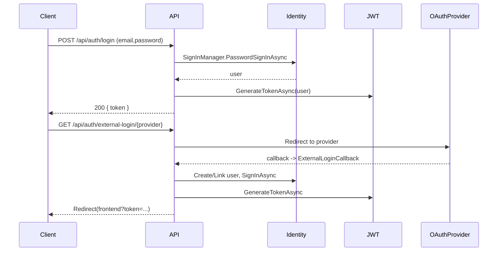

# FocusZone — Backend (StuckIn)

> Scalable ASP.NET Core backend for learning, study sessions, exams, subscriptions and CV generation.

<p align="center">
  
  
  
  
  
  
  
  
  
</p>

---

## About

FocusZone (internal name: StuckIn) backend is an enterprise-ready ASP.NET Core Web API that provides authentication (Identity + JWT), external OAuth (Google, GitHub), subscription & payment flows (Stripe), learning domain models (topics, resources, study/exam sessions), user topic mastery tracking and CV generation via an external LaTeX/AI agent.

The codebase is organized into three main projects:
- PL — Presentation Layer (Web API, controllers, DI/startup)
- BL — Business Logic (services, DTOs, mappings)
- DAL — Data Access (EF Core DbContext, entities, repositories, migrations)

This README documents the actual implementation, architecture, configuration and operational steps for developers and operators.

---

## Highlights / Implemented Features

- JWT authentication and token generation (BL/Services/Implementation/JwtTokenService.cs)
- ASP.NET Identity (User extends IdentityUser)
- External OAuth: Google and GitHub (Program.cs + AuthController)
- Email-based password reset (AuthController + EmailService)
- Role-based authorization (e.g., PaidUser role enforced for CV generation)
- Stripe-based payments and checkout sessions (PL/PaymentController, BL/PaymentService)
- Subscription lifecycle management (SubscriptionService + HostedService)
- Hosted background service for subscription expiration checks (PL/Services/SubscriptionExpirationHostedService.cs)
- CV generation pipeline: AI agent → LaTeX → PDF conversion (BL/CVService + PL/CVController)
- CRUD endpoints for user profile sub-resources (Education, Experience, Projects, Certificates, Goals)
- Topic/resource models and user-topic mastery with EF Core constraints and composite keys
- Data migration utility for merging legacy data (DAL/Utilities/DataMigrationUtility.cs)
- AutoMapper mappings for DTOs (BL/Mapper/MappingProfile.cs)
- EF Core Migrations included (DAL/Migrations)

---

## Technology Stack (actual)

- ASP.NET Core Web API (net10.0)
- Entity Framework Core (SQL Server provider)
- ASP.NET Core Identity (EF store)
- JWT (System.IdentityModel.Tokens.Jwt)
- AutoMapper
- Stripe.net
- Swashbuckle / OpenAPI (Swagger)
- Hosted BackgroundService
- HttpClient
- AspNet.Security.OAuth.GitHub / Google authentication packages

---

## Architecture Overview

- Layered architecture: Presentation (PL) → Business (BL) → Data (DAL)
- Patterns: Dependency Injection, Service pattern (I*Service), Repository/GenericRepository, DTO mapping (AutoMapper), EF Core migrations
- App startup performs automated migrations and seeding, registers services and authentication schemes, and hosts background tasks.

Mermaid architecture diagram:

```mermaid
flowchart LR
  subgraph PL [Presentation]
    Controllers[Controllers (API)]
    Program[Program.cs / DI & Startup]
    Controllers -->|calls| ServicesBL
  end

  subgraph BL [Business Logic]
    ServicesBL[Services (Payment, Auth, CV, Subscription, Topic)]
    DTOs[DTOs & Mappings]
    ServicesBL --> DTOs
  end

  subgraph DAL [Data Access]
    Db[AppDbContext (EF Core)]
    Entities[Entities & Migrations]
    Repos[GenericRepository]
    ServicesBL --> Db
    Db --> Entities
    Db --> Repos
  end

  subgraph External
    Stripe[Stripe API]
    SMTP[SMTP Provider]
    OAuth[Google / GitHub]
    LaTeXAgent[LaTeX / AI Agent]
    ServicesBL --> Stripe
    ServicesBL --> SMTP
    Controllers --> OAuth
    BL --> LaTeXAgent
  end
```

---

## Project Structure (actual)

- PL/
  - Controllers/ (HTTP controllers)
  - Services/
  - Program.cs
  - appsettings.json
- BL/
  - Services/
  - DTOs/
  - Mapper/
  - Specifications/
- DAL/
  - Database/
  - Entities/
  - Repositories/
  - Utilities/
  - Migrations/
- Shared/

Purpose summary:
- Controllers expose RESTful endpoints.
- BL implements business rules, external integrations and token logic.
- DAL defines domain model, constraints and persistence.
- Program.cs wires authentication, DI, hosted services, migration and seeding.

---

## Database (schema & EF Core)

- AppDbContext inherits IdentityDbContext<User>.
- Key domain entities: User, SubscriptionPlan, Subscription, Payment, Topic, Resource, StudySession, Evidence, UserTopicMastery, ExamSession, SessionAnswer, AnswerChoice, SessionWhiteList, SessionExamActive.
- Relationships and constraints:
  - Composite keys (e.g., UserTopicMastery: UserId + TopicId).
  - Cascade/delete behaviors defined for related entities.
  - Check constraints on enums/typed columns (e.g., evidence types, resource types).
  - Precision configured for decimal fields (price, score, coverage etc).
- Soft-delete implementation: Global query filter on User.IsDeleted and related entities.
- Migrations:
  - Migrations exist in DAL/Migrations.
  - Startup applies pending migrations automatically via ServiceCollectionExtensions.EnsureDatabaseCreatedAndMigrated invoked in Program.cs.

EF Core workflow (recommended for contributors):

- Add migration: dotnet ef migrations add <Name> --project DAL/DAL.csproj --startup-project PL/PL.csproj
- Apply migration locally: dotnet ef database update --project DAL/DAL.csproj --startup-project PL/PL.csproj
- CI/CD: apply migrations during deployment or use a migrations step in release pipeline.

---

## Authentication & Authorization

Implemented mechanisms:
- ASP.NET Identity for user store, password hashing and token providers.
- JWT: tokens created by JwtTokenService include claims (NameIdentifier, Email, Roles, FirstName, LastName, SessionMinutes). JWT validation configured in Program.cs (Issuer, Audience, SecretKey).
- External OAuth: Google & GitHub configured via authentication handlers. AuthController handles external login redirect and callback and links/creates Identity accounts accordingly.
- Password reset: ForgotPassword generates a token from UserManager, Base64Url-encodes it for front-end, and sends an email; ResetPassword decodes and calls ResetPasswordAsync.
- Role-based checks: endpoints such as CV generation enforce "PaidUser" role.

Mermaid authentication flow:



---

## API Endpoints (complete, grouped by controller)

Base path: /api/{controller}

(See controllers in PL/Controllers for implementation and full route signatures.)

---

## Configuration (keys present)

Sensitive keys are present in PL/appsettings.json in the repository for development convenience but MUST be replaced in production with environment variables or a secure secret store.

Important configuration sections (use environment variables / secret stores in production):
- ConnectionStrings:DefaultConnection — SQL Server connection
- Authentication:
  - Jwt: SecretKey, Issuer, Audience, ExpirationMinutes
  - Google: ClientId, ClientSecret
  - GitHub: ClientId, ClientSecret
- Stripe: PublishableKey, SecretKey
- EmailSettings:Smtp — Host, Port, SenderEmail, SenderPassword, SenderName, EnableSSL
- AppSettings: FrontendUrl, AppUrl
- LatexConverter / Agents: LaTeX and AI agent endpoints and keys

Best practices:
- Do not commit secrets. Use user secrets for local dev and environment/Key Vault for CI/CD.
- Ensure JWT SecretKey length >= 32 bytes for HMAC-SHA256 security.

---

## Running Locally (developer guide)

Prerequisites:
- .NET 10 SDK
- SQL Server instance accessible (localdb/Azure/other)
- Optional: dotnet-ef CLI tools (dotnet tool install --global dotnet-ef)

Steps:

1. Clone:
   - git clone <repo>
   - cd <repo-root>

2. Restore & build:
   - dotnet restore
   - dotnet build

3. Configure settings:
   - Update PL/appsettings.json (for local dev) OR set environment variables for:
     - ConnectionStrings__DefaultConnection
     - Authentication__Jwt__SecretKey
     - Stripe__SecretKey
     - EmailSettings__Smtp__SenderEmail and SenderPassword
     - AppSettings__FrontendUrl

4. Run database migrations:
   - dotnet ef database update --project DAL/DAL.csproj --startup-project PL/PL.csproj

5. Run the API:
   - dotnet run --project PL/PL.csproj
   - Swagger UI: https://localhost:{port}/swagger

Notes:
- Program.cs runs database migration and DbInitializer.InitializeAsync on startup; ensure migration step does not conflict with startup migration in CI.
- For external OAuth local testing, configure provider redirect URIs to match the running host.

---

## Deployment

The backend is currently deployed on **MonsterASP.NET**, providing a Windows-based hosting environment for ASP.NET Core applications.

### Deployment Environment

- Hosting Provider: MonsterASP.NET
- Runtime: ASP.NET Core
- Database: SQL Server
- HTTPS Enabled
- Environment-based configuration using `appsettings.json`

### Deployment Workflow

1. Publish the ASP.NET Core project.
2. Upload the published files to MonsterASP.NET.
3. Configure the SQL Server connection string.
4. Update environment-specific settings (JWT, SMTP, Stripe, etc.).
5. Apply Entity Framework Core migrations.
6. Verify the API using Swagger.

### Production Considerations

- Use HTTPS for all endpoints.
- Store sensitive configuration securely.
- Monitor application logs.
- Regularly back up the SQL Server database.
---

## Background Jobs & Scheduling

- SubscriptionExpirationHostedService (PL/Services/SubscriptionExpirationHostedService.cs):
  - Runs hourly to find expired subscriptions, update user paid state and remove "PaidUser" role where applicable.

Recommendation:
- For heavy workloads, offload scheduled work to a durable job runner or Azure Functions/Queue + worker for idempotency and scale.

---

## Error Handling & Observability

- Controllers use local try/catch in several places; global exception middleware is not present.
- Model validation uses ModelState checks in many endpoints.
- HTTP status codes follow common 200/201/400/401/404/409/500 patterns.

Recommendations for enterprise readiness:
- Add global exception handling middleware returning RFC7807 ProblemDetails.
- Add correlation IDs and structured logging (Serilog + enrichers).
- Add health checks and metrics (Prometheus / Application Insights).

---

## Security

- Identity + Password hashing (built-in Identity).
- Password policies enforced in Program.cs (length, character classes, lockout).
- JWT with issuer/audience and signing key; tokens include role claims.
- CORS restricted to configured frontend (AppSettings:FrontendUrl) in Program.cs; HTTPS redirection enabled.
- Sensitive secrets must be moved to secure stores for production.

---

## Performance & Scalability

- Dependency injection and async/await are used across services and controllers.
- EF Core: retry policies and command timeout configured in UseSqlServer options.
- Decimal precision and database constraints optimize data integrity and reduce application-level validation overhead.

Recommendations:
- Add caching for frequently read data (topics, subscription plans).
- Apply pagination (already used via PaginationParams in several endpoints).
- Add indexes for common query patterns (e.g., Users by Email, Subscriptions by EndDate).

---

## Future Improvements (prioritized)

1. Centralized exception middleware + structured logging (Serilog).
2. Add integration & unit tests (xUnit) and CI pipeline.
3. Add Dockerfile and Helm chart for containerized deployments.
4. Implement Stripe webhooks to handle async payment events.
5. Health checks and metrics (Prometheus/App Insights).
6. Improve security posture: rate limiting, refresh tokens, rotating signing keys.
7. Harden migrations: add safety checks and pre-deploy migration validation.

---

## Contributors

Contributors are tracked in Git history. For community contributions:
- Fork → feature branch → pull request with tests and documentation updates.

---

## License

No LICENSE file detected in repository. Add an appropriate license (e.g., MIT, Apache-2.0) to make this project open source.

---

## Contact & Next Steps

Inspect these key files for core behavior:
- PL/Program.cs (startup & auth)
- DAL/Database/AppDbContext.cs (schema & constraints)
- BL/Services/Implementation/JwtTokenService.cs (JWT)
- BL/Services/Implementation/SubscriptionService.cs and PaymentService.cs
- PL/Services/SubscriptionExpirationHostedService.cs

Suggested immediate actions to improve repo for enterprise:
- Add LICENSE
- Add CONTRIBUTING.md and CODE_OF_CONDUCT
- Add Dockerfile and CI pipeline with migration step and tests
- Add global exception middleware and structured logging

---

*This README was generated from the repository contents and reviewed for enterprise usage.*
